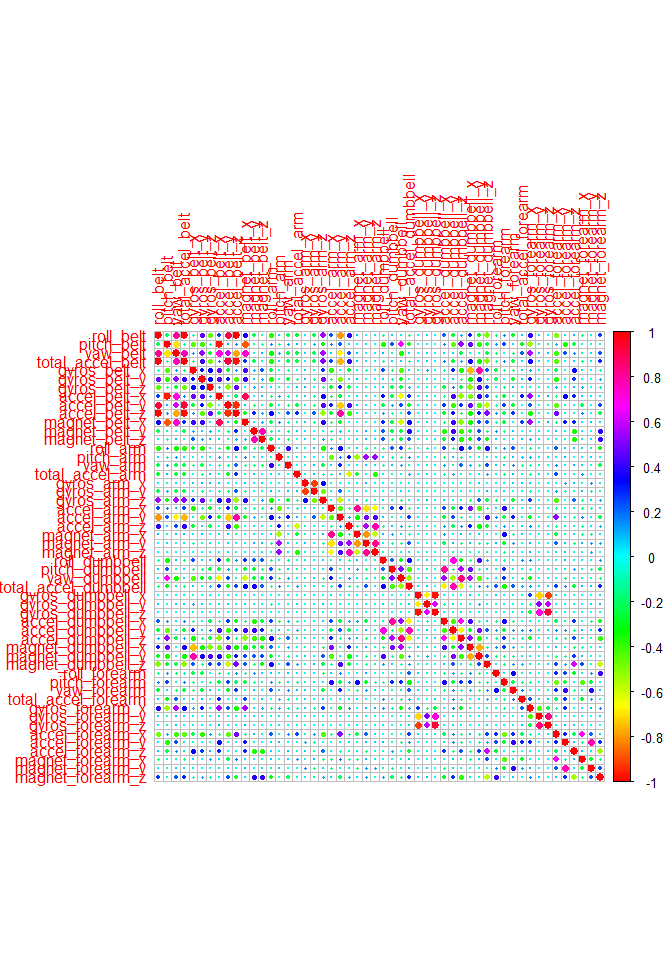

# Classification of personal fitness device activity data for prediction
Saturday, June 20, 2015  

##Background
Currently there are various fitness monitoring devices on the market including: *Jawbone*, *Nike Fuelband*, and *Fitbit*. These devices can collect a large amount of data about personal activity levels. These are leveraged by indivuals who wish to improve their health through finding patterns in thier activies. In the current work, we are going to use these data sets to train a random forest model in an effort to predict new data based on the data.


###Data Loading and Examination 
I am going to start by loading in the data and having a quick look at. I will also load in a bunch of useful libraries


```r
library(caret)
library(randomForest)
library(corrplot)
library(doParallel) #this will speed things up per the forums
cl <- makeCluster(detectCores())
registerDoParallel(cl)
```


```r
#we also want to make sure strings tha have nothing in them, as well as NA are considers NAs
DataIn <- read.csv("pml-training.csv", na.strings = c("NA", ""))
dim(DataIn)
```

```
## [1] 19622   160
```

We know that the first seven columns are not useful (they are ids, time stamps, etc...) so we will remove them. I will also remove columns that contain NA values. There are 52 variables left over.

```r
#This part takes out the first seven columns
Data <- DataIn[,8:dim(DataIn)[2]] 
#remove columns that have NAs
Data <- Data[, colSums(is.na(Data)) == 0]
```

We next will perform a quick correlation matrix exploratory analysis. 


```r
#remove the classe variable since it isn't numeric
Plot_corr <- cor(Data[, -dim(Data)[2]])
corrplot(Plot_corr,col=rainbow(200))
```

 

The plot shows that there are regions of strong correlation such as the belt data at the upper right with the various data from the belt, and corrleation with arm data and belt data moving downward. Each set of measurements (i.e. all the belts, all the arms... etc..) have good correlation with themselves. This is seen moving down the diagonal, but they are the terms that are not exactly on the diagonal.

##Modeling with Random Forests

I am going to split the *Data* data frame into the training and test sets.

```r
#just like we did in class. I'm going to put break it up into 2/3 training 1/3 test 
set.seed(12341)
inTrain <- createDataPartition(y=Data$classe, p=0.66, list=FALSE)
DataTraining <- Data[inTrain, ]; DataTesting <- Data[-inTrain, ]
nrow(DataTraining)
```

```
## [1] 12953
```

```r
nrow(DataTesting)
```

```
## [1] 6669
```

Now let's train our model!

```r
set.seed(12341)
#I'm going to use a 6 fold cross validation
#using randomForest is faster as per the discussion forums
modFit <- randomForest(classe~ .,data=DataTraining,method="rf",prox=TRUE, trControl=trainControl(method = "cv", number = 6),ntree=150)
#I played around with tree to get a good test set accuracy
```

Now let's see how it does on the Training set

```r
set.seed(12341)
#I'm going to use a 6 fold cross validation
#using randomForest is faster as per the discussion forums
TrainingPredict <- predict(modFit, DataTraining, type = "class")
confusionMatrix(DataTraining$classe,TrainingPredict)
```

```
## Confusion Matrix and Statistics
## 
##           Reference
## Prediction    A    B    C    D    E
##          A 3683    0    0    0    0
##          B    0 2507    0    0    0
##          C    0    0 2259    0    0
##          D    0    0    0 2123    0
##          E    0    0    0    0 2381
## 
## Overall Statistics
##                                      
##                Accuracy : 1          
##                  95% CI : (0.9997, 1)
##     No Information Rate : 0.2843     
##     P-Value [Acc > NIR] : < 2.2e-16  
##                                      
##                   Kappa : 1          
##  Mcnemar's Test P-Value : NA         
## 
## Statistics by Class:
## 
##                      Class: A Class: B Class: C Class: D Class: E
## Sensitivity            1.0000   1.0000   1.0000   1.0000   1.0000
## Specificity            1.0000   1.0000   1.0000   1.0000   1.0000
## Pos Pred Value         1.0000   1.0000   1.0000   1.0000   1.0000
## Neg Pred Value         1.0000   1.0000   1.0000   1.0000   1.0000
## Prevalence             0.2843   0.1935   0.1744   0.1639   0.1838
## Detection Rate         0.2843   0.1935   0.1744   0.1639   0.1838
## Detection Prevalence   0.2843   0.1935   0.1744   0.1639   0.1838
## Balanced Accuracy      1.0000   1.0000   1.0000   1.0000   1.0000
```

We can perfect fitting of the training set, which makes sense, although we could be overfitting.

Next, let's see how this performs on the the test set 

```r
#I'm going to use a 6 fold cross validation
#using randomForest is faster as per the discussion forums
TestingPredict <- predict(modFit, DataTesting, type = "class")
confusionMatrix(DataTesting$classe,TestingPredict)
```

```
## Confusion Matrix and Statistics
## 
##           Reference
## Prediction    A    B    C    D    E
##          A 1893    3    1    0    0
##          B    4 1281    5    0    0
##          C    0    5 1157    1    0
##          D    0    0   11 1082    0
##          E    0    0    5    1 1220
## 
## Overall Statistics
##                                           
##                Accuracy : 0.9946          
##                  95% CI : (0.9925, 0.9962)
##     No Information Rate : 0.2845          
##     P-Value [Acc > NIR] : < 2.2e-16       
##                                           
##                   Kappa : 0.9932          
##  Mcnemar's Test P-Value : NA              
## 
## Statistics by Class:
## 
##                      Class: A Class: B Class: C Class: D Class: E
## Sensitivity            0.9979   0.9938   0.9813   0.9982   1.0000
## Specificity            0.9992   0.9983   0.9989   0.9980   0.9989
## Pos Pred Value         0.9979   0.9930   0.9948   0.9899   0.9951
## Neg Pred Value         0.9992   0.9985   0.9960   0.9996   1.0000
## Prevalence             0.2845   0.1933   0.1768   0.1625   0.1829
## Detection Rate         0.2839   0.1921   0.1735   0.1622   0.1829
## Detection Prevalence   0.2845   0.1934   0.1744   0.1639   0.1838
## Balanced Accuracy      0.9985   0.9961   0.9901   0.9981   0.9994
```
We get out of sample error of ~ 0.5% (1-0.995) for all classes. This is very good accuracy for our test set. 

Let's run this on our final data which I will submit. (The file creation script is not included, but is the one shown in the course website.)

```r
#read in data
DataTest <- read.csv("pml-testing.csv", na.strings = c("NA", ""))
#subset vector for subsetting final test data
vect<-names(DataTest) %in% names( DataTesting )
#index based on the names
DataFinalTest <- DataTest[,vect]
#run the prediction
FinalDataPrediction <- predict(modFit, DataFinalTest)
```
